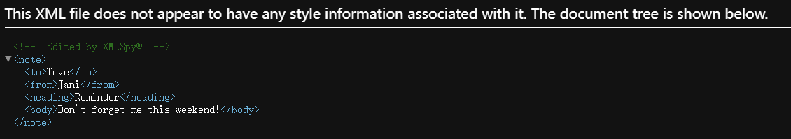
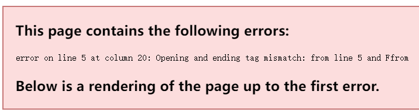
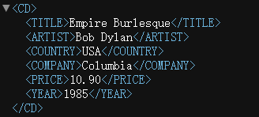
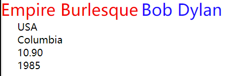

## XML 教程
- XML 指可扩展标记语言（e**X**tensible **M**arkup **L**anguage）。
- XML 被设计用来传输和存储数据，不用于表现和展示数据，HTML 则用来表现数据。
- XML 很重要，也很容易学习。

### XML 实例
XML 文档第一行以 XML 声明开始，用来表述文档的一些信息，如：
```xml
<?xml version="1.0" encoding="UTF-8"?>
```

XML 定义结构、存储信息、传送信息。

XML 文档实例
```xml
<?xml version="1.0" encoding="UTF-8"?>
<site>
  <name>RUNOOB</name>
  <url>https://www.runoob.com</url>
  <logo>runoob-logo.png</logo>
  <desc>编程学习网站</desc>
</site>
```

`<name>`、`<url>`、`<logo>`、`<desc>` 分别为标签，标签内包含了要传递的信息。
标签必须成对出现，有开始标签就需要有结束标签，例如：
- 开始标签：`<name>`
- 结束标签：`</name>`


## XML 简介
- XML 被设计用来传输和存储数据。
- HTML 被设计用来显示数据。
- XML 指可扩展标记语言（eXtensible Markup Language）。
- 可扩展标记语言（英语：Extensible Markup Language，简称：XML）是一种标记语言，是从标准通用标记语言（SGML）中简化修改出来的。它主要用到的有可扩展标记语言、可扩展样式语言（XSL）、XBRL和XPath等。

### 应该掌握的基础知识
在您继续学习之前，需要对以下知识有基本的了解：
- HTML
- JavaScript

### 什么是 XML？
- XML 指可扩展标记语言（EXtensible Markup Language）。
- XML 是一种很像HTML的标记语言。
- XML 的设计宗旨是传输数据，而不是显示数据。
- XML 标签没有被预定义。您需要自行定义标签。
- XML 被设计为具有自我描述性。
- XML 是 W3C 的推荐标准。

### XML 和 HTML 之间的差异
- XML 不是 HTML 的替代。
- XML 和 HTML 为不同的目的而设计：
- XML 被设计用来传输和存储数据，其焦点是数据的内容。
- HTML 被设计用来显示数据，其焦点是数据的外观。
- HTML 旨在显示信息，而 XML 旨在传输信息。

### XML 不会做任何事情
也许这有点难以理解，但是 XML 不会做任何事情。XML 被设计用来结构化、存储以及传输信息。
下面实例是 Jani 写给 Tove 的便签，存储为 XML：
```xml
<note>
  <to>Tove</to>
  <from>Jani</from>
  <heading>Reminder</heading>
  <body>Don't forget me this weekend!</body>
</note>
```
上面的这条便签具有自我描述性。它包含了发送者和接受者的信息，同时拥有标题以及消息主体。
但是，这个 XML 文档仍然没有做任何事情。它仅仅是包装在 XML 标签中的纯粹的信息。我们需要编写软件或者程序，才能传送、接收和显示出这个文档。

### 通过 XML 您可以发明自己的标签
上面实例中的标签没有在任何 XML 标准中定义过（比如 `<to>` 和 `<from>`）。这些标签是由 XML 文档的创作者发明的。
这是因为 XML 语言没有预定义的标签。
HTML 中使用的标签都是预定义的。HTML 文档只能使用在 HTML 标准中定义过的标签（如 `<p>`、`<h1>` 等等）。
XML 允许创作者定义自己的标签和自己的文档结构。

### XML 不是对 HTML 的替代
**XML 是对 HTML 的补充。**
XML 不会替代 HTML，理解这一点很重要。在大多数 Web 应用程序中，XML 用于传输数据，而 HTML 用于格式化并显示数据。
对 XML 最好的描述是：
**XML 是独立于软件和硬件的信息传输工具。**

### XML 是 W3C 的推荐标准
XML 于 1998 年 2 月 10 日成为 W3C 的推荐标准。
<!-- 如需了解有关 W3C XML 活动的更多信息，请访问我们的 W3C 教程。 -->

### XML 无所不在
目前，XML 在 Web 中起到的作用不会亚于一直作为 Web 基石的 HTML。
XML 是各种应用程序之间进行数据传输的最常用的工具。


## XML 用途
XML 应用于 Web 开发的许多方面，常用于简化数据的存储和共享。

### XML 把数据从 HTML 分离
如果您需要在 HTML 文档中显示动态数据，那么每当数据改变时将花费大量的时间来编辑 HTML。
通过 XML，数据能够存储在独立的 XML 文件中。这样您就可以专注于使用 HTML/CSS 进行显示和布局，并确保修改底层数据不再需要对 HTML 进行任何的改变。
通过使用几行 JavaScript 代码，您就可以读取一个外部 XML 文件，并更新您的网页的数据内容。

### XML 简化数据共享
在真实的世界中，计算机系统和数据使用不兼容的格式来存储数据。
XML 数据以纯文本格式进行存储，因此提供了一种独立于软件和硬件的数据存储方法。
这让创建不同应用程序可以共享的数据变得更加容易。

### XML 简化数据传输
对开发人员来说，其中一项最费时的挑战一直是在互联网上的不兼容系统之间交换数据。
由于可以通过各种不兼容的应用程序来读取数据，以 XML 交换数据降低了这种复杂性。

### XML 简化平台变更
升级到新的系统（硬件或软件平台），总是非常费时的。必须转换大量的数据，不兼容的数据经常会丢失。
XML 数据以文本格式存储。这使得 XML 在不损失数据的情况下，更容易扩展或升级到新的操作系统、新的应用程序或新的浏览器。

### XML 使您的数据更有用
不同的应用程序都能够访问您的数据，不仅仅在 HTML 页中，也可以从 XML 数据源中进行访问。
通过 XML，您的数据可供各种阅读设备使用（掌上计算机、语音设备、新闻阅读器等），还可以供盲人或其他残障人士使用。

### XML 用于创建新的互联网语言
很多新的互联网语言是通过 XML 创建的。
这里有一些实例：
- XHTML
- 用于描述可用的 Web 服务 的 WSDL
- 作为手持设备的标记语言的 WAP 和 WML
- 用于新闻 feed 的 RSS 语言
- 描述资本和本体的 RDF 和 OWL
- 用于描述针针对 Web 的多媒体 的 SMIL

### 假如开发人员都是理性的
**假如他们都是理性的，就让未来的应用程序使用 XML 来交换数据吧。**
未来也许会出现某种字处理软件、电子表格程序以及数据库，它们可以使用 XML 格式读取彼此的数据，而不需要使用任何的转换程序。


## XML 树结构
XML 文档形成了一种树结构，它从"根部"开始，然后扩展到"枝叶"。

### 一个 XML 文档实例
XML 文档使用简单的具有自我描述性的语法：
```xml
<!-- XML 声明。它定义 XML 的版本（1.0）和所使用的编码（UTF-8 : 万国码, 可显示各种语言）。 -->
<?xml version="1.0" encoding="UTF-8"?>
<!-- 描述文档的根元素（像在说："本文档是一个便签"） -->
<note>
  <!-- 描述根的 4 个子元素（to, from, heading 以及 body） -->
  <to>Tove</to>
  <from>Jani</from>
  <heading>Reminder</heading>
  <body>Don't forget me this weekend!</body>
<!-- 定义根元素的结尾 -->
</note>
```

您可以假设，从这个实例中，XML 文档包含了一张 Jani 写给 Tove 的便签。

### XML 文档形成一种树结构
XML 文档必须包含根元素。该元素是所有其他元素的父元素。
XML 文档中的元素形成了一棵文档树。这棵树从根部开始，并扩展到树的最底端。
所有的元素都可以有子元素：
```xml
<root>
  <child>
    <subchild>
      .....
    </subchild>
  </child>
</root>
```
父、子以及同胞等术语用于描述元素之间的关系。父元素拥有子元素。相同层级上的子元素成为同胞（兄弟或姐妹）。
所有的元素都可以有文本内容和属性（类似 HTML 中）。


### 实例


上图表示下面的 XML 中的一本书：
```xml
<bookstore>
  <book category="COOKING">
    <title lang="en">Everyday Italian</title>
    <author>Giada De Laurentiis</author>
    <year>2005</year>
    <price>30.00</price>
  </book>
  <book category="CHILDREN">
    <title lang="en">Harry Potter</title>
    <author>J K. Rowling</author>
    <year>2005</year>
    <price>29.99</price>
  </book>
  <book category="WEB">
    <title lang="en">Learning XML</title>
    <author>Erik T. Ray</author>
    <year>2003</year>
    <price>39.95</price>
  </book>
</bookstore>
<!-- 实例中的根元素是 <bookstore>。文档中的所有 <book> 元素都被包含在 <bookstore> 中。
<book> 元素有 4 个子元素：<title>、<author>、<year>、<price>。 -->
```


## XML 语法
XML 的语法规则很简单，且很有逻辑。这些规则很容易学习，也很容易使用。

### XML 文档必须有根元素
XML 必须包含根元素，它是所有其他元素的父元素，比如以下实例中 root 就是根元素：
```xml
<root>
  <child>
    <subchild>.....</subchild>
  </child>
</root>
```

以下实例中 note 是根元素：
```xml
<?xml version="1.0" encoding="UTF-8"?>
<note>
  <to>Tove</to>
  <from>Jani</from>
  <heading>Reminder</heading>
  <body>Don't forget me this weekend!</body>
</note>
```

### XML 声明
XML 声明文件的可选部分，如果存在需要放在文档的第一行，如下所示：
```xml
<?xml version="1.0" encoding="utf-8"?>
```
- 1.0是xml的版本号
- utf-8是编码。

> UTF-8 是 HTML5, CSS, JavaScript, PHP, 和 SQL 的默认编码。

### 所有的 XML 元素都必须有一个关闭标签
在 HTML 中，某些元素不必有一个关闭标签：
```xml
<p>This is a paragraph.
<br>
```

在 XML 中，省略关闭标签是非法的。所有元素都**必须**有关闭标签：
```xml
<p>This is a paragraph.</p>
<br />
```

> 您或许注意到上面的实例中，有的 XML 声明没有关闭标签。
> 这不是错误。声明不是 XML 文档本身的一部分，它没有关闭标签。

### XML 标签对大小写敏感
XML 标签对大小写敏感。标签 `<Letter>` 与标签 `<letter>` 是不同的。

必须使用相同的大小写来编写打开标签和关闭标签：
```xml
<Message>这是错误的</message>
<message>这是正确的</message>
```

> 打开标签和关闭标签通常被称为开始标签和结束标签。
> 不论您喜欢哪种术语，它们的概念都是相同的。

### XML 必须正确嵌套
在 HTML 中，常会看到没有正确嵌套的元素：
```html
<b><i>This text is bold and italic</b></i>
```

在 XML 中，所有元素都必须彼此正确地嵌套：
```xml
<b><i>This text is bold and italic</i></b>
```

在上面的实例中，正确嵌套的意思是：由于 `<i>` 元素是在 `<b>` 元素内打开的，那么它必须在 `<b>` 元素内关闭。

### XML 属性值必须加引号
与 HTML 类似，XML 元素也可拥有属性（名称/值的对）。
在 XML 中，XML 的属性值必须加引号。
```xml
<note date=12/11/2007>错误</note>
<note date="12/11/2007">正确</note>
```
前者错误的原因是 note 元素中的 date 属性没有加引号。

### 实体引用
在 XML 中，一些字符拥有特殊的意义。
如果您把字符 `<` 放在 XML 元素中，会发生错误，这是因为解析器会把它当作新元素的开始。
这样会产生 XML 错误：
```xml
<message>if salary < 1000 then</message>
```

为了避免这个错误，请用实体引用来代替 < 字符：
```xml
<message>if salary &lt; 1000 then</message>
```

在 XML 中，有 5 个预定义的实体引用：
| .        | .   | .              |
| -------- | --- | -------------- |
| `&lt;`   | <   | less than      |
| `&gt;`   | >   | greater than   |
| `&amp;`  | &   | ampersand      |
| `&apos;` | '   | apostrophe     |
| `&quot;` | "   | quotation mark |

> 在 XML 中，只有字符 `<` 和 `&` 确实是非法的。大于号是合法的，但是用实体引用来代替它是一个好习惯。

### XML 中的注释
在 XML 中编写注释的语法与 HTML 的语法很相似。
```xml
<!-- 这是一条注释。 -->
<!-- 
  注释可以跨行，
  比如这就是一个多行注释。
 -->
```

### 在 XML 中，空格会被保留
HTML 会把多个连续的空格字符裁减（合并）为一个：
Hello&nbsp;&nbsp;&nbsp;&nbsp;Tove
输出结果:	Hello Tove

**在 XML 中，文档中的空格不会被删减。**

### XML 以 LF 存储换行
- 在 Windows 应用程序中，换行通常以一对字符来存储：回车符（CR）和换行符（LF）。
- 在 Unix 和 Mac OSX 中，使用 LF 来存储新行。
- 在旧的 Mac 系统中，使用 CR 来存储新行。
- XML 以 LF 存储换行。


## XML 元素
XML 文档包含 XML 元素。

### 什么是 XML 元素？
XML 元素指的是从（且包括）开始标签直到（且包括）结束标签的部分。
一个元素可以包含：
- 其他元素
- 文本
- 属性
- 或混合以上所有...

```xml
<bookstore>
  <book category="CHILDREN">
    <title>Harry Potter</title>
    <author>J K. Rowling</author>
    <year>2005</year>
    <price>29.99</price>
  </book>
  <book category="WEB">
    <title>Learning XML</title>
    <author>Erik T. Ray</author>
    <year>2003</year>
    <price>39.95</price>
  </book>
</bookstore>
```

> 在上面的实例中，`<bookstore>` 和 `<book>` 都有 元素内容，因为他们包含其他元素。`<book>` 元素也有属性（category="CHILDREN"）。`<title>`、`<author>`、`<year>` 和 `<price>` 有文本内容，因为他们包含文本。

### XML 命名规则
XML 元素必须遵循以下命名规则：
- 名称可以包含字母、数字以及其他的字符
- 名称不能以数字或者标点符号开始
- 名称不能以字母 xml（或者 XML、Xml 等等）开始
- 名称不能包含空格

可使用任何名称，没有保留的字词。

### 最佳命名习惯
- 使名称具有描述性。使用下划线的名称也很不错：`<first_name>`、`<last_name>`。
- 名称应简短和简单，比如：`<book_title>`，而不是：`<the_title_of_the_book>`。
- 避免 "-" 字符。如果您按照这样的方式进行命名："first-name"，一些软件会认为您想要从 first 里边减去 name。
- 避免 "." 字符。如果您按照这样的方式进行命名："first.name"，一些软件会认为 "name" 是对象 "first" 的属性。
- 避免 ":" 字符。冒号会被转换为命名空间来使用（稍后介绍）。
- XML 文档经常有一个对应的数据库，其中的字段会对应 XML 文档中的元素。有一个实用的经验，即使用数据库的命名规则来命名 XML 文档中的元素。
- 在 XML 中，éòá 等非英语字母是完全合法的，不过需要留意，您的软件供应商不支持这些字符时可能出现的问题。

### XML 元素是可扩展的
XML 元素是可扩展，以携带更多的信息。

实例：
```xml
<note>
  <to>Tove</to>
  <from>Jani</from>
  <body>Don't forget me this weekend!</body>
</note>
```
设想我们创建了一个应用程序，可将 `<to>`、`<from>` 以及 `<body>` 元素从 XML 文档中提取出来，并产生以下的输出：
> **MESSAGE**
> **To**: Tove
> **From**: Jani
> Don't forget me this weekend!

此时 XML 文档的作者添加的一些额外信息：
```xml
<note>
  <date>2008-01-10</date>
  <to>Tove</to>
  <from>Jani</from>
  <heading>Reminder</heading>
  <body>Don't forget me this weekend!</body>
</note>
```
这个应用程序仍然可以找到 XML 文档中的 `<to>`、`<from>` 以及 `<body>` 元素，并产生同样的输出。

> 可扩展性是 XML 的优势之一，其可以在不中断应用程序的情况下进行扩展。


## XML 属性
XML元素具有属性，类似 HTML。
属性（Attribute）提供有关元素的额外信息。

### XML 属性
在 HTML 中，属性提供有关元素的额外信息：
```html

<a href="demo.html">
```

属性通常提供不属于数据组成部分的信息。在下面的实例中，文件类型与数据无关，但是对需要处理这个元素的软件来说却很重要：
```xml
<file type="gif">computer.gif</file>
```

### XML 属性必须加引号
属性值必须被引号包围，不过单引号和双引号均可使用。比如一个人的性别，person 元素可以这样写：
```xml
<person sex="female">
```

或者这样也可以：
```xml
<person sex='female'>
```

如果属性值本身包含双引号，您可以使用单引号，就像这个实例：
```xml
<gangster name='George "Shotgun" Ziegler'>
```

或者您可以使用字符实体：
```xml
<gangster name="George &quot;Shotgun&quot; Ziegler">
```

### XML 元素 vs. 属性
实例：
```xml
<person sex="female">
  <firstname>Anna</firstname>
  <lastname>Smith</lastname>
</person>
```

```xml
<person>
  <sex>female</sex>
  <firstname>Anna</firstname>
  <lastname>Smith</lastname>
</person>
```
在第一个实例中，sex 是一个属性。在第二个实例中，sex 是一个元素。这两个实例都提供相同的信息。

> 并没有什么规则告诉我们什么时候该使用属性，什么时候该使用元素。
> 在 HTML 中，属性通常用起来很便利，但是在 XML 中，应尽量避免使用属性。

### 避免 XML 属性？
因使用属性而引起的一些问题：
- 属性无法包含多个值（子元素可以）
- 属性无法描述树结构（子元素可以）
- 属性不易扩展（为未来的变化）

属性难以阅读和维护。请尽量使用元素来描述数据。而仅仅使用属性来提供与数据无关的信息。

不要做这样的蠢事（这不是 XML 应该被使用的方式）：
```xml
<note day="10" month="01" year="2008" to="Tove" from="Jani" heading="Reminder" body="Don't forget me this weekend!"></note>
```

这才是 XML 的正确打开方式：
```xml
<note>
  <date>
    <day>10</day>
    <month>01</month>
    <year>2008</year>
  </date>
  <to>Tove</to>
  <from>Jani</from>
  <heading>Reminder</heading>
  <body>Don't forget me this weekend!</body>
</note>
```

### 针对元数据的 XML 属性
有时候会向元素分配 ID 引用。这些 ID 索引可用于标识 XML 元素，它起作用的方式与 HTML 中 id 属性是一样的。
```xml
<messages>
  <note id="501">
    <to>Tove</to>
    <from>Jani</from>
    <heading>Reminder</heading>
    <body>Don't forget me this weekend!</body>
  </note>
  <note id="502">
    <to>Jani</to>
    <from>Tove</from>
    <heading>Re: Reminder</heading>
    <body>I will not</body>
  </note>
</messages>
```
上面的 id 属性仅仅是一个标识符，用于标识不同的便签。并不是便签数据的组成部分。

> 元数据（有关数据的数据）应当存储为属性，而数据本身应当存储为元素。


## XML 验证
拥有正确语法的 XML 被称为"形式良好"的 XML。
通过 DTD 验证的XML是"合法"的 XML。

### 形式良好的 XML 文档
**形式良好**的 XML 文档拥有正确的语法。

在前面的章节描述的语法规则：
- XML 文档必须有一个根元素
- XML元素都必须有一个关闭标签
- XML 标签对大小写敏感
- XML 元素必须被正确的嵌套
- XML 属性值必须加引号

### 验证 XML 文档
合法的 XML 文档是"形式良好"的 XML 文档，这也符合文档类型定义（DTD）的规则：
```xml
<?xml version="1.0" encoding="ISO-8859-1"?>
<!DOCTYPE note SYSTEM "Note.dtd">
<note>
  <to>Tove</to>
  <from>Jani</from>
  <heading>Reminder</heading>
  <body>Don't forget me this weekend!</body>
</note>
```
在上面的实例中，DOCTYPE 声明是对外部 DTD 文件的引用。
下面的段落展示了这个文件的内容。

### XML DTD
DTD 的目的是定义 XML 文档的结构。它使用一系列合法的元素来定义文档结构：
```dtd
<!DOCTYPE note
[
<!ELEMENT note (to,from,heading,body)>
<!ELEMENT to (#PCDATA)>
<!ELEMENT from (#PCDATA)>
<!ELEMENT heading (#PCDATA)>
<!ELEMENT body (#PCDATA)>
]>
```

若要了解更多DTD知识，[此处](https://www.runoob.com/dtd/dtd-tutorial.html)

### XML Schema
W3C 支持一种基于 XML 的 DTD 代替者，它名为 XML Schema：
```xml
<xs:element name="note">
<xs:complexType>
<xs:sequence>
<xs:element name="to" type="xs:string"/>
<xs:element name="from" type="xs:string"/>
<xs:element name="heading" type="xs:string"/>
<xs:element name="body" type="xs:string"/>
</xs:sequence>
</xs:complexType>
</xs:element>
```

若要了解更多XML Schema知识，[此处](https://www.runoob.com/schema/schema-tutorial.html)

<!-- ### 一个通用的 XML 验证器 -->
<!-- 为了帮助您检查 XML 文件的语法，我们创建了 XML 验证器，以便您对任何 XML 文件进行语法检查。 -->


<!-- ## XML 验证器 -->


## XML 查看
在所有主流的浏览器中，均能够查看原始的 XML 文件。
不要指望 XML 文件会直接显示为 HTML 页面。

### 查看 XML 文件


### 查看无效的 XML 文件
如果一个错误的XML文件被打开，浏览器会报告错误。


### 为什么 XML 显示这个样子？
XML 文档不会携带有关如何显示数据的信息。
由于 XML 标签由 XML 文档的作者"发明"，浏览器无法确定像 `<table>` 这样一个标签究竟描述一个 HTML 表格还是一个餐桌。
在没有任何有关如何显示数据的信息的情况下，大多数的浏览器都会仅仅把 XML 文档显示为源代码。


## XML CSS
通过使用 CSS（Cascading Style Sheets 层叠样式表），您可以添加显示信息到 XML 文档中。

### 使用 CSS 显示您的 XML？
使用 CSS 来格式化 XML 文档是有可能的。

前：
后：

使用方式
```xml
<?xml-stylesheet type="text/css" href="cd_catalog.css"?>
```

> 使用 CSS 格式化 XML 不是常用的方法。


## XML XSLT
通过使用 XSLT，您可以把 XML 文档转换成 HTML 格式。

### 使用 XSLT 显示 XML
XSLT 是首选的 XML 样式表语言。
XSLT（eXtensible Stylesheet Language Transformations）远比 CSS 更加完善。
XSLT 是在浏览器显示 XML 文件之前，先把它转换为 HTML。

若要了解更多XML XSLT知识，[此处](https://www.runoob.com/xsl/xsl-tutorial.html)

### 在服务器上通过 XSLT 转换 XML
当浏览器读取 XML 文件时，XSLT 转换是由浏览器完成的。
在使用 XSLT 来转换 XML 时，不同的浏览器可能会产生不同结果。为了减少这种问题，可以在服务器上进行 XSLT 转换。
